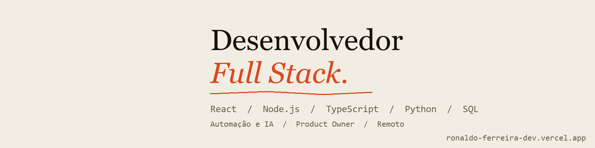

# Olá, eu sou o Ronaldo

Desenvolvedor Full Stack e Product Owner, de São Gonçalo, RJ, com foco em **levantamento de requisitos e implantação de sistemas e ERP**. Comecei como estagiário na Green Code, uma empresa de software pequena, e passei por front-end, full stack, produto e pré-vendas. Cursando Engenharia de Software (Estácio, conclusão em 2027).

Portfólio: https://ronaldo-ferreira-dev.vercel.app

## Casos de produto e implantação

O código dos projetos de empresas e clientes é privado, então documentei os casos, com roteiro de implantação:

- [Litso: ERP para barbearias, salões e clínicas](https://github.com/ronaldofojrdev/casos/blob/main/casos/litso-erp.md): do requisito ao teste, como único responsável
- [ERP e PDV para varejo, com NFC-e (RJ)](https://github.com/ronaldofojrdev/casos/blob/main/casos/erp-pdv-varejo.md): caixa, estoque, fiscal e impressão
- [Todos os casos](https://github.com/ronaldofojrdev/casos)

## No que tenho trabalhado

- BoraRachar, app de divisão de custos com versão web e aplicativo iOS: Product Owner e hoje responsável técnico ([borarachar.com.br](https://borarachar.com.br))
- Litso, sistema de gestão para salões, barbearias e clínicas ([litso.com.br](https://litso.com.br))
- Front-end em React de um banco digital (MWPay)
- Automações com IA, web scraping e dashboards em Elasticsearch e Power BI

## Projetos com código aberto

- [portfolio](https://github.com/ronaldofojrdev/portfolio): o site do meu portfólio
- [freelas-bot](https://github.com/ronaldofojrdev/freelas-bot): bot em Python que avalia projetos do 99Freelas com um modelo local (Ollama)
- [atendente-whatsapp-clinicas](https://github.com/ronaldofojrdev/atendente-whatsapp-clinicas): atendente de WhatsApp com IA para clínicas, em Node e TypeScript
- [Condofy](https://github.com/ronaldofojrdev/Condofy): gestão de condomínios com Next.js e Supabase (em desenvolvimento)

## Stack

Também uso Azure DevOps, Jira, Confluence, SQL, Power BI e Scrum no dia a dia.

## Contato

- LinkedIn: [ronaldo-ferreira-dev](https://www.linkedin.com/in/ronaldo-ferreira-dev/)
- E-mail: ronaldofojr1@gmail.com
- Aberto a vagas de implantação, requisitos e produto (CLT ou PJ), remoto ou híbrido no RJ
